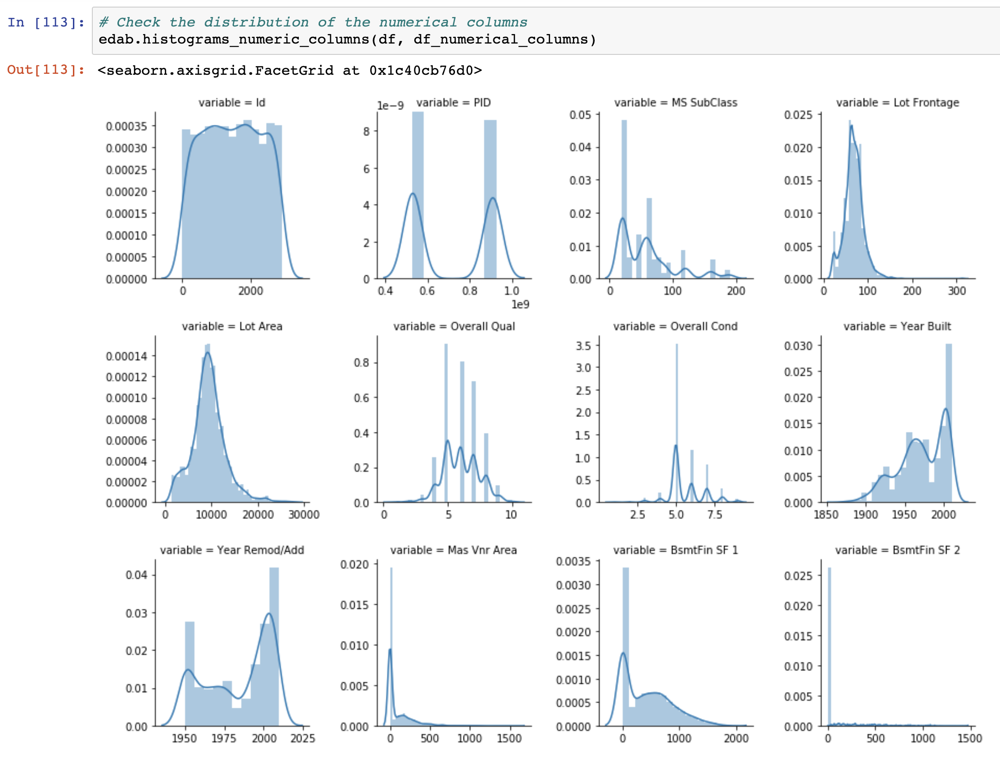
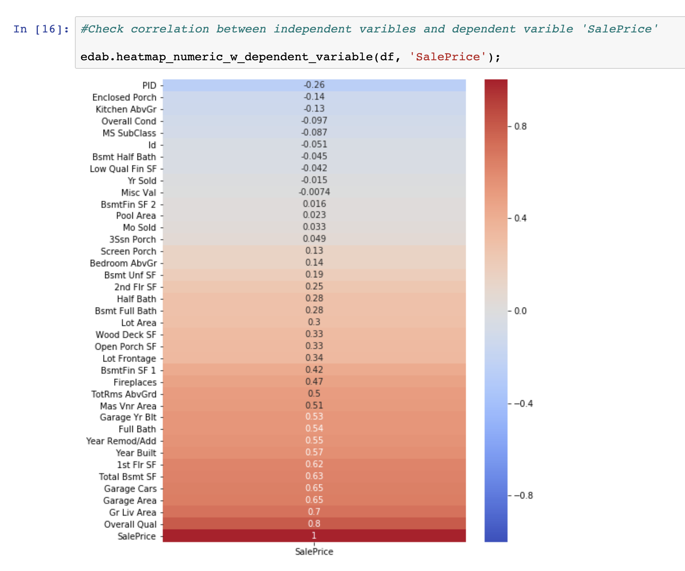

# Creating Python Functions for Exploratory Data Analysis and Data Cleaning

Exploratory Data Analysis and Data Cleaning are two essential steps before
we start to develop Machine Learning Models, and they can be quite
time-consuming, especially for people who are still familiarizing themselves
with this whole process. 

EDA and Data Cleaning is rarely a one-time, linear process: you might find
yourself going back to earlier sections and modifying the way you treat the dataset
quite often. One way to speed up this process is to recycle some of the code
you find yourself using over and over again. This is why we should create
functions to automate the repetitive parts of EDA and Data Cleaning. Another
benefit of using functions in the EDA and Data Cleaning is to eliminate the
inconsistency of results caused by accidental differences in the code. 

In this blog post, I will walk you through a few useful python functions that I
created for EDA and Data Cleaning. The library containing all these functions can
be cloned from my repository [`eda_and_beyond`](https://github.com/FredaXin/eda_and_beyond/blob/master/eda_and_beyond.py).
Special thanks to all the people who contributed to this small (but growing) library. 

___ 

## Functions for Handling Missing Values

One important step in the EDA is to inspect missing values, study if there are any
patterns in the missing values, and make a decision about how to deal with them
accordingly. 

The first function here is to give you a general idea of the total and
percentage of missing data in each column:

```
def intitial_eda_checks(df):
    '''
    Takes df
    Checks nulls
    '''
    if df.isnull().sum().sum() > 0:
        mask_total = df.isnull().sum().sort_values(ascending=False) 
        total = mask_total[mask_total > 0]

        mask_percent = df.isnull().mean().sort_values(ascending=False) 
        percent = mask_percent[mask_percent > 0] 

        missing_data = pd.concat([total, percent], axis=1, keys=['Total', 'Percent'])
    
        print(f'Total and Percentage of NaN:\n {missing_data}')
    else: 
        print('No NaN found.')
```

After the initial inspection, you can decide if you want to have a closer
inspection on those columns with excessive missing values. With specification of the
threshold of the missing value percentage, the following
function will give you a list of columns that have missing values over that
threshold:


```
def view_columns_w_many_nans(df, missing_percent):
    '''
    Checks which columns have over specified percentage of missing values
    Takes df, missing percentage
    Returns columns as a list
    '''
    mask_percent = df.isnull().mean()
    series = mask_percent[mask_percent > missing_percent]
    columns = series.index.to_list()
    print(columns) 
    return columns
```

There are many ways to deal with missing values. If you decide to drop the
columns with too many missing values (over a certain threshold you specify), you can use this function
to accomplish the task:
```
def drop_columns_w_many_nans(df, missing_percent):
    '''
    Takes df, missing percentage(default=.9)
    Drops the columns whose missing value is bigger than missing percentage
    Returns df
    '''
    series = view_columns_w_many_nans(df, missing_percent=missing_percent)
    list_of_cols = series.index.to_list()
    df.drop(columns=list_of_cols)
    print(list_of_cols)
    return df
```

However, there are many downsides of deleting missing values from your dataset,
such as reduced statistical power. If you decide to impute the missing values
instead, check out Sklearn's
[`SimpleImputer`](https://scikit-learn.org/stable/modules/generated/sklearn.impute.SimpleImputer.html)
module,
which is an easy-to-use tool to impute missing values whichever way strikes
your fancy. 


In addition, if you'd like to read more about how to deal with missing values, check out this
helpful [slide](https://liberalarts.utexas.edu/prc/_files/cs/Missing-Data.pdf)
created by Melissa Humphries at Population Research Center. 


---
## Functions for Data Visualization

The human brain is very good at identify patterns, and this is why visualizing your
dataset during the EDA process and identifying the patterns can be very beneficial. For instance, histograms
make analyzing the distribution of the data an easier task; Boxplot is great for
identifying outliers; Scatter plot is very useful when it comes to checking the
correlations between two variables. [Matplotlib](https://matplotlib.org/) and [Seaborn](https://seaborn.pydata.org/) are your best friends
when it comes to data visualization. However, creating individual plot(s) for
each features can become tedious if you have a large number of features. In this
section, I will walk you through a few functions for creating group plots that can help you to
kill many birds with one function. 

We often want to look at the distributions of columns with numerical values.
The following function will create a group plot for all numerical columns in your
dataset. This function is adapted from Dominik Gawlik's [blog
post](https://www.kaggle.com/dgawlik/house-prices-eda#Categorical-data), which
is a great read
for the entire EDA process with real dataset:
```
def histograms_numeric_columns(df, numerical_columns):
    '''
    Takes df, numerical columns as list
    Returns group histagrams
    '''
    f = pd.melt(df, value_vars=numerical_columns) 
    g = sns.FacetGrid(f, col='variable',  col_wrap=4, sharex=False, sharey=False)
    g = g.map(sns.distplot, 'value')
    return g
```
Here is what the output looks like: 


Another helpful visualization tool is heatmap. Heatmap comes very handy what you
want to check the correlation between your dependent and independent variables.
Oftentimes, heatmap can be visually cluttered if you have too many
features. One way to avoid it is to create a heatmap just for the dependent
variable(target) and independent variables(features). The following function
will assist you with this task: 

```
def heatmap_numeric_w_dependent_variable(df, dependent_variable):
    '''
    Takes df, a dependant variable as str
    Returns a heatmap of independent variables' correlations with dependent variable 
    '''
    plt.figure(figsize=(8, 10))
    g = sns.heatmap(df.corr()[[dependent_variable]].sort_values(by=dependent_variable), 
                    annot=True, 
                    cmap='coolwarm', 
                    vmin=-1,
                    vmax=1) 
    return g
```
As you can see in the output, the correlations becomes easier to read since the
values are sorted: 



---
## Functions for Changing Data Types

Ensuring your features are of the correct datatypes is another important step
during the EDA and Data Cleaning process. It happens quite often that Pandas'
`.read_csv()` method would interpret datatypes differently than the original
data file. Reading the data dictionary is very illuminating during this step.
Additionally, if you are planning to do some feature engineering, changing data
types is required. The following two functions work hand in hand to transform
categorical features into numerical (ordinal): 

The first function is to output a function, i.e. a transformer, that
will transform each `str` in a list into a `int`, whereas the `int` is the index of
that element in the list.
```
def categorical_to_ordinal_transformer(categories):
    '''
    Returns a function that will map categories to ordinal values based on the
    order of the list of `categories` given. Ex.

    If categories is ['A', 'B', 'C'] then the transformer will map 
    'A' -> 0, 'B' -> 1, 'C' -> 2.
    '''
    return lambda categorical_value: categories.index(categorical_value)

```
The second function has two parts: first, it takes a dictionary in
the form as follows: 

```
categorical_numerical_mapping = {'Utilities': ['ELO', 'NoSeWa', 'NoSewr', 'AllPub'],
                                 'Exter Qual': ['Po', 'Fa', 'TA', 'Gd', 'Ex'],
                                 'Exter Cond': ['Po', 'Fa', 'TA', 'Gd', 'Ex']}
```
Using the previous function we define earlier, it turns the dictionary into this:

```
transformers = {'Utilities': [0, 1, 2, 3],
                'Exter Qual': <exter_qual_transformer>,
                'Exter Cond': <exter_cond_transfomer>}
```

The second part of the function uses the `.map()` method to map each transformer function
onto the dataframe. Note that a copy of the original
dataframe will be created during this function. 

```
def transform_categorical_to_numercial(df, categorical_numerical_mapping):
    '''
    Transforms categorical columns to numerical columns
    Takes a df, a dictionary 
    Returns df
    '''
    transformers = {k: categorical_to_ordinal_transformer(v) 
                    for k, v in categorical_numerical_mapping.items()}
    new_df = df.copy()
    for col, transformer in transformers.items():
        new_df[col] = new_df[col].map(transformer).astype('int64')
    return new_df
```

---

This will conclude my blog post. I aim to create an open source library to make
the EDA and Data Cleaning process more streamlined. As always, I'd love to hear your feedback. If you have any corrections or want to contribute to this small
open source project, please make a pull request. Thank you for reading! 
