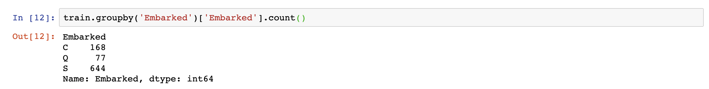
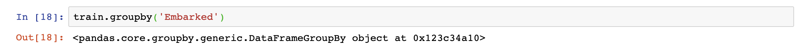
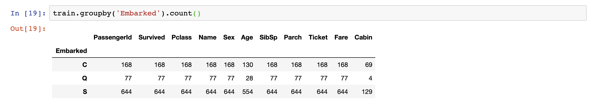
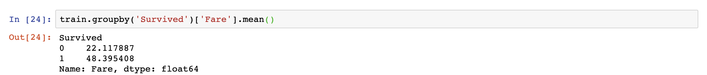
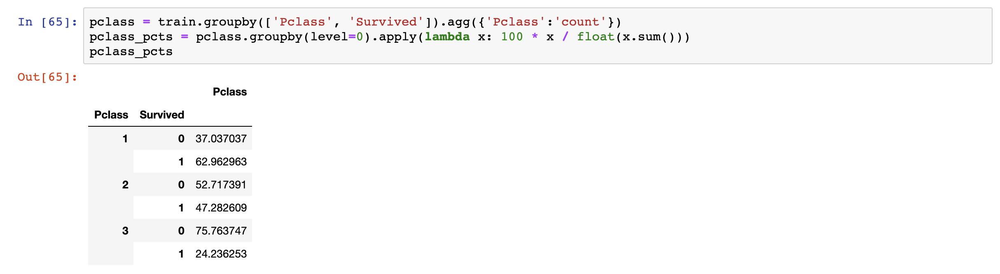

# GROUP BY in `pandas` and SQL
## A Comparison of Aggregation Functions 

An essential component of data analysis is to generate summaries by computing
aggregations such as sum, max, min, mean, median etc. This way, we can develop
some understanding of the general shape of the data. This is especially
important for large datasets, where looking at the raw data might not yield any
meaningful insights.

In this blog post, I will first describe the underlining mechanism of
`Group By`, and then compare the implementations of the `Group By` concept in
Python's `pandas` library and SQL.

---

## What is Group By? 
As the `pandas` Development Team stated elegantly on their [documentation for the GroupBy
object](https://pandas.pydata.org/pandas-docs/stable/user_guide/groupby.html),
`Group By` involves three steps:

- Step 1: **Split** the data into groups based on some criteria 
- Step 2: **Apply**  a function to each group independently 
- Step 3: **Combine** the results into a data structure

In the context of analyzing a data frame, Step 1 amounts to finding a column and
using the unique values of that column to split the data frame into groups. Step
2 is to select a function, such as aggregate, transform, or filter. The selected
function will operate on each individual group. The results of Step 2 will be
merged and displayed as a new data structure in Step 3.

All the above might still sound rather abstract; let's try it out using a real dataset from 
the [Titanic Kaggle Competition](https://www.kaggle.com/c/titanic/data). (Note
that there are two datasets available and I will be using "train.csv" in
this blog post.)

---

## Group By in `pandas`
The Python `pandas` library has an efficient operation called `groupby` to perform
the Group By task. 

In the Titanic dataset, there is a columns called "Embarked" that provides
information about ports of embarkation for each passenger. There are three
distinct values: C, Q, and S (C = Cherbourg, Q = Queenstown, S = Southampton).
If we want to check out the number of passengers embarked on each port, we can
use the following command: 

```
train.groupby('Embarked')['Embarked'].count()
```

It gives the following output:



Let's break this down a little using the  **split-apply-combine** steps.

**Step 1** is to select the column "Embarked", using its unique values -- i.e.
C, Q, S -- to split our dataset into three categories. 

Note that at this stage, no operation has been performed on the groups. The
command `train.groupby('Embarked')` merely outputs a `GroupBy` object:



**Step 2** is to select the `count()` method as our function, which yields the
total number for each category. 

**Step 3** is to combine and display the results. `pandas` GroupBy object supports
column indexing, and we can specify which columns we want to see in the aggregated results. In our case, we only care about the column
"Embarked". Without this specification, `pandas` will return aggregated results
for all numerical columns as follows: 




## Group by in SQL
The Group By concept is an essential component SQL's syntax. Despite some
syntactic difference, SQL's `GOURP BY` statement works in a similar way as
`pandas`'.

The above `pandas` operation can be implemented in SQL as follows:

```
SELECT Embarked, COUNT(Embarked)
FROM titanic.train
GROUP BY Embarked;
```

In the `GROUP BY` statement, the column "Embarked" is selected to split the
dataset. In the second part of the `SELECT` statement, `COUNT()` is chosen as
the aggregation function. The `SELECT` statement also contains information of
which columns we want to display in the output. The first occurrence of "Embarked" is
equivalent to `pandas`' column indexing `[Embarked]`. One other minor difference is
that SQL uses the `FROM` statement to specify which dataset we are working with,
i.e. the "train" table from the "titanic" schema;
whereas in `pandas`, we put the name of the data frame in the beginning of the
`groupby` command. 

---

## Advanced Examples 

### Example 1
If we want to see the average fare amounts for passengers who survived vs.
perished, we can use the following command in `pandas`: 

```
train.groupby('Survived')['Fare'].mean()
```

Which gives out the following output: 



Similarly, we can achieve this in SQL with: 

```
SELECT Survived, AVG(Fare)
FROM titanic.train
GROUP BY Survived;
```

As we can see, the people who survived paid a much higher fare on average than those
who perished. 

### Example 2
There were three passenger classes ("Pclass") on the Titanic, 1, 2, and 3. Suppose we
want to inspect the percentage of people who survived vs. perished for each
class, we can use the following `groupby` command in conjunction with the
`.apply()` method in `pandas`: 

```
pclass = train.groupby(['Pclass', 'Survived']).agg({'Pclass':'count'})

pclass_pcts = pclass.groupby(level=0).apply(
    lambda x: 100 * x / float(x.sum()))

```
Note that in the `.apply()` method, we can pass a `lambda` function to calculate the
percentage. 



This can also be achieved in SQL using [WINDOW functions](https://www.postgresql.org/docs/current/tutorial-window.html):

```
WITH t1 AS 
 (SELECT Pclass, Survived, Count(*) AS n 
  FROM titanic.train
  GROUP BY Pclass, Survived)
SELECT Pclass, Survived, 100 * n / (SUM(n) OVER (PARTITION BY Pclass))s
FROM t1;
```

We can conclude that the survival rates decreases as the passenger classes
decreases. 

---

This will conclude my blog post. The implementations of Group By in `pandas` and
SQL are very versatile and can be used in conjunction with many other functions,
which deserves further exploration.

Thank you for reading. As always, I'd love to hear from you if you have any
comments or feedback.

--- 

## References
- [*Python Data Science
  Handbook*](https://www.amazon.com/dp/1491912057/ref=cm_sw_em_r_mt_dp_U_E2gqEbTK340BE)
  by Jake VanderPlas

- [SQL Window Functions](https://www.postgresql.org/docs/current/tutorial-window.html)

- [`pandas` Documentation for the GroupBy
Object](https://pandas.pydata.org/pandas-docs/stable/user_guide/groupby.html)
