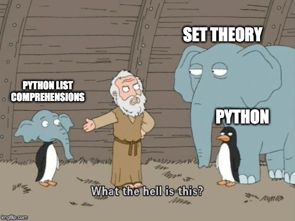

# List Comprehensions in Python and Set Builder Notation in Set Theory 

In this post I will discuss the similarities and connections between **list
comprehensions** in Python and **set builder notation** in Set Theory. I will
also briefly compare them with list comprehensions in Haskell.

## List Comprehensions in Python

A list comprehension in Python will let you construct a new list by iterating
through each element in a given list (or any iterable objects in python,
such as dictionaries and tuples). The syntax of a list comprehension is as
follows: 

 ```python
 s = [x**2 for x in range(21) if x*2 < 21]
 ```

The purpose of this expression is to iterate through each element in a list of
integers from 0 and 20, select the ones whose double is less than 21, and return a new list where each element is squared. 

This is basically a short-handed version of a `for` loop, and the value for `s`
produced by the above expression can also be achieved as follows: 

```python
s = []
for x in range(21):
    if x*2 < 21:
        s.append(x**2)
```

As you can see, `for x in range(21)` in the list comprehension is essentially the header of the `for` loop. The filter `if x*2 < 21` is equivalent to the `if` conditional within the `for` loop. One major difference here is that the list comprehension saves us the trouble of constructing a empty list and appending the result of each loop to it. 

Since a list comprehension can always be written as a `for` loop, why do we want to use the former? In general, if used correctly, list comprehensions have many virtues: 

- *Concise*: Instead of writing a whole block of control flow statement, we can just use a one-line expression, which makes our code more concise. 

- *Versatile*: List comprehensions are versatile in terms of syntax and the locations where we can employ them. Syntax-wise, list comprehensions are very expressive: we can add [ternary operators](https://data-flair.training/blogs/python-ternary-operator/) for the variables, nested loops using a couple of `for` clauses, and multiple filters with `if` clauses etc. Location-wise, a list comprehension can be plugged in places such as a return statement, or as a nested expression within some other expressions. 

- *Efficient*: Comparing to `for` loops, list comprehensions are more efficient and run faster. As Mark Lutz pointed out in his book [*Learning
  Python*](https://www.amazon.com/Learning-Python-5th-Mark-Lutz/dp/1449355730),
  "depending on your Python and code, list comprehensions might run much faster
  than manual `for` loop statements (often roughly twice as fast) because their
  iterations are performed at C language speed inside the interpreter, rather
  than with manual Python code. Especially for larger data sets, there is often
  a major performance advantage to using this expression."

## Set-Builder Notation in Set Theory

Now we have seen how list comprehensions work in Python, I will compare them with the set-builder notations in set theory. 

I had a moment of Déjà vu when I first learned about list comprehensions in Python: the syntax looks a lot like [set-builder notation](https://en.wikipedia.org/wiki/Set-builder_notation) in set theory. For comparison, let's express the above Python list comprehension in set-builder notation:


This can be read as "S is the set of all numbers 'x squared' where x is an item in the set of integers between 0 and 20, for which x doubled is less than 21". Using this as an example, let's compare this notation with Python list comprehension expression: 

- The curly braces show that the result S is a set; whereas in Python, square braces are used to indicated that the result is a list (For dictionary comprehensions in Python, curly braces are used, but it does not indicate the result is a set). 
- Within the curly braces, and left of the vertical bar,  x**2 is the output notation, same as list comprehension.
- The part on the right of the vertical bar is equivalent to the `for` clause in list comprehension. 
- On the right of the comma is a filter, which is the same as the `if` clause in list comprehension. 

Despite some subtle differences, the resemblance between set-builder notation and list comprehensions in Python is evident. It is as if list comprehensions in Python are the love child of Set Theory and Python! 

  

Well, this "love child" is not a coincidence: the syntax of list comprehensions in Python was first [introduced](https://www.python.org/dev/peps/pep-0202/#id2) by Barry Warsaw in 2000 as a new feature for Python 2.0. This was inspired by list comprehensions in the functional programming language Haskell. Haskell picked up this feature from Miranda, which is a language designed by British computer scientist [David Turner](https://en.wikipedia.org/wiki/David_Turner_(computer_scientist)) and had a strong influence on Haskell. David Turner mentioned the connection between list comprehensions and set theory in his paper ["Some History of Functional Programming Languages"](https://www.cs.kent.ac.uk/people/staff/dat/tfp12/tfp12.pdf):
> 
>SASL continued to evolve gently, acquiring floating point numbers and list comprehensions in 1983. The latter were inspired by Darlington’s “set expressions”  [...], but applied to lazy lists. [...] I initially called these ZF expressions, a reference to Zermelo-Frankel set theory — it was Phil Wadler who coined the better term list comprehension.

## List Comprehensions in Haskell

Now let's compare the set builder notation with list comprehensions in Haskell. The above python example can be written as follows: 

 ```haskell
s = [ x^2 | x <- [0..20], x*2 < 21 ]
 ``` 

As we can see, the resemblance between list comprehensions in Haskell and set-builder notion is even more evident. 

This will conclude my blog post. I hope that through the comparison between list comprehensions in Python, and set-builder notation, the syntax and usage of the former will become clearer for people who are not familiar with this expression. For myself, I hope to explore more about the application of list comprehensions in functional programming languages. 

Thank you for reading. As always, I'd love to hear from you if you have any comments or feedback.     
    
___

## References
- [*Learning Python*](https://www.amazon.com/Learning-Python-5th-Mark-Lutz/dp/1449355730) by Mark Lutz
- [*List comprehension*](https://brilliant.org/wiki/list-comprehension/) by Alex Chumbley, Karleigh Moore, Agnishom Chattopadhyay, and 1 other contributed
- [*Python in a Nutshell*](https://www.oreilly.com/library/view/python-in-a/0596001886/ch04s09.html) by Alex Martelli
- [*Some History of Functional Programming Languages*](https://www.cs.kent.ac.uk/people/staff/dat/tfp12/tfp12.pdf) by David Turner
